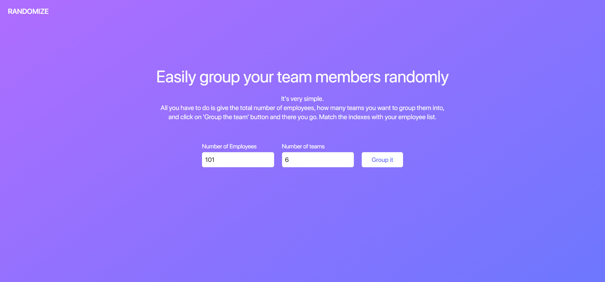
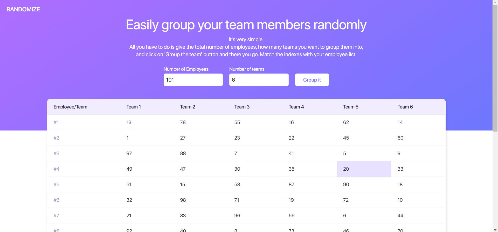

## Randomize - Effortlessly Divide Participants into Balanced Teams

This project is a web application that aims to simplify the process of creating teams by randomly dividing a given number of participants into balanced groups. The goal is to provide an efficient and impartial method of team formation, eliminating the need for manual and subjective methods.

### Features

- Randomly divide a specified number of participants into balanced teams.
- Impartial team formation algorithm to ensure fairness.
- User-friendly interface with easy navigation.
- Provision for customizable team size and participant count.
- A lightweight front-end app with fast performance.

### Screenshots

### Frontend Tech Stack

- ReactJs, SCSS

### Getting Started

1. Clone the repository to your local machine: git clone the [repository](https://github.com/tkmpraveens/randomize.git)
2. Navigate to the project directory: cd randomize
3. Install the required dependencies: `npm i` or `npm install`
4. Start the development server: `npm start`
5. Open your browser and navigate to http://localhost:3000

### Contribution Guidelines

We welcome contributions to this project. To get started, please fork the repository, make your changes, and submit a pull request.

### License

This project is licensed under the MIT License. See the LICENSE file for details.

### Contact

For questions or feedback, don't hesitate to contact us by opening an issue in the repository.
